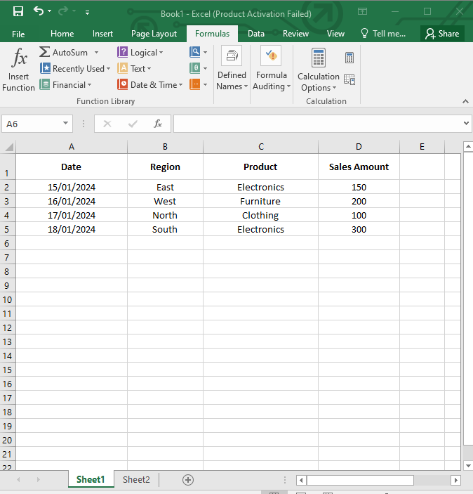
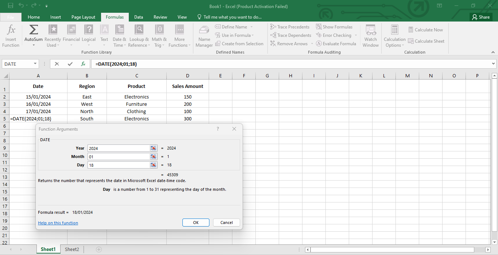
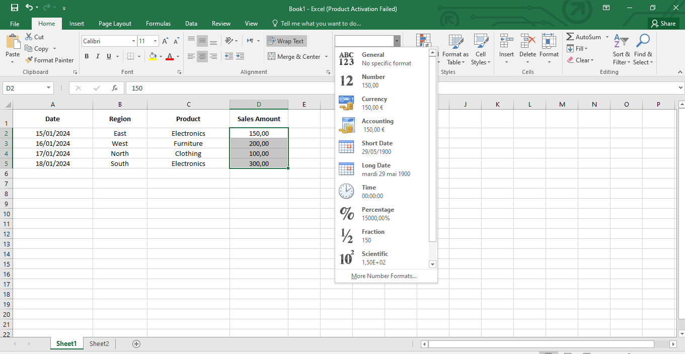
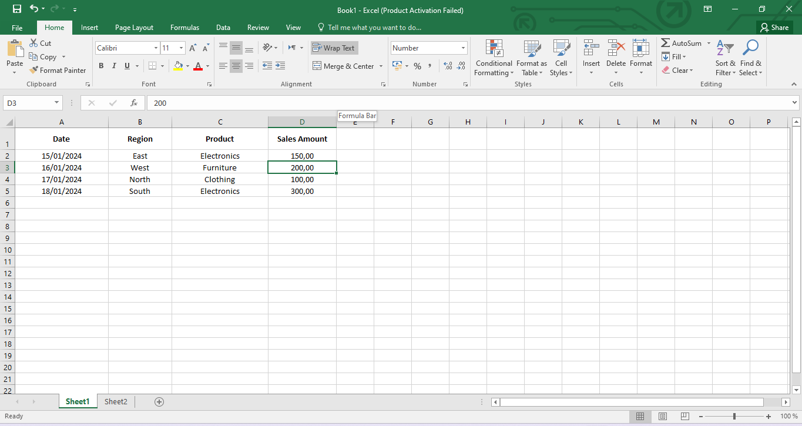
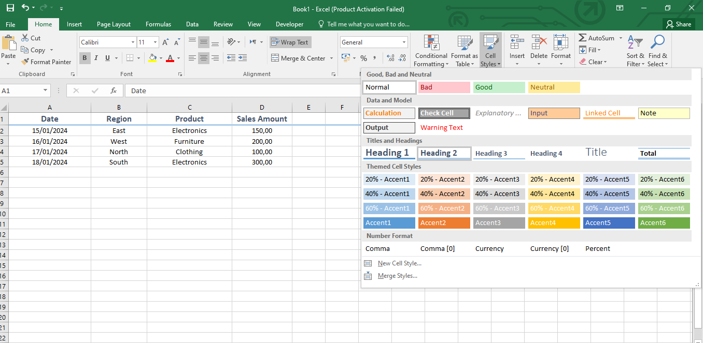
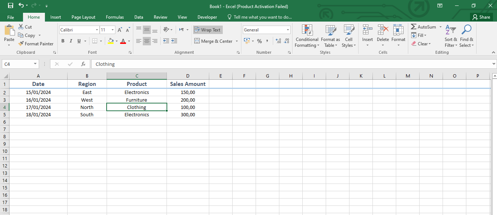
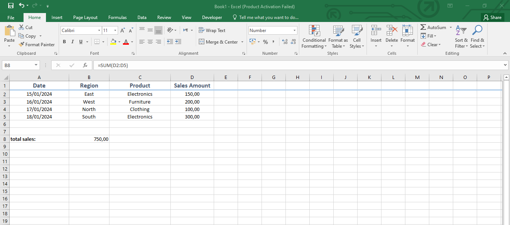
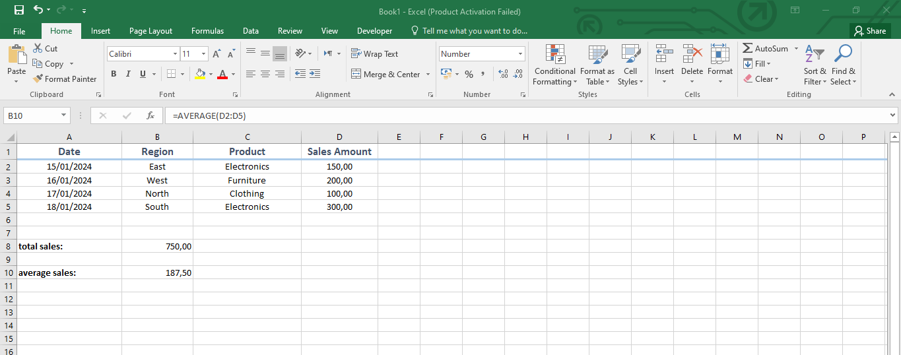
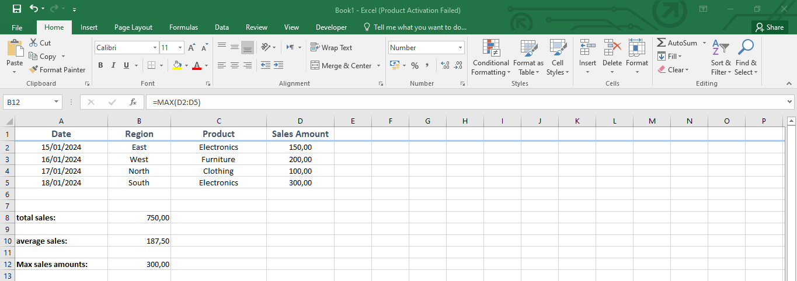
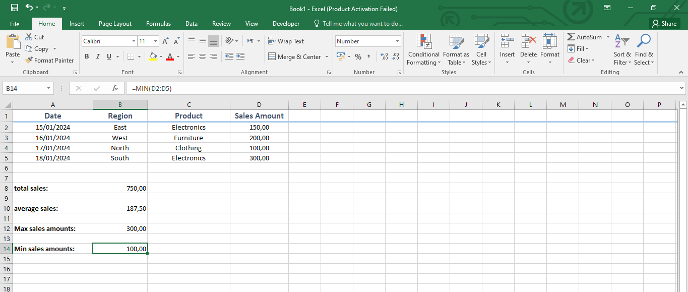

# Tutorial Documentation for Lab 1: Excel Basics for Data Analytics

### **Project Name:**

**Excel Basics for Data Analytics**

---

## **Introduction:**

In this lab, you will work as a junior data analyst for a retail company. Your task is to clean, manipulate, and analyze sales data using Microsoft Excel. The dataset provided contains sales data such as dates, sales regions, product categories, and sales amounts. You will perform tasks like data entry, using formulas, sorting/filtering, data cleaning, and basic visualizations to present your findings.

---

## **Steps for Lab 1:**

---

### **Step 1: Understanding the Dataset**

Create or download a simple Excel dataset with columns like:

- **Date**: The date of the sale.
- **Region**: Sales region (East, West, North, South).
- **Product**: Product category (Electronics, Furniture, Clothing).
- **Sales Amount**: The amount of each sale.

**Sample Dataset:**

| Date | Region | Product | Sales Amount |
| --- | --- | --- | --- |
| 2024-01-15 | East | Electronics | 150 |
| 2024-01-16 | West | Furniture | 200 |
| 2024-01-17 | North | Clothing | 100 |
| 2024-01-18 | South | Electronics | 300 |



---

### **Step 2: Entering and Formatting Data**

1. **Open Excel** and create a new worksheet.
2. Manually enter the sales data (as shown in the table above).
3. **Format the cells**:
    - Select the **Date** column, and format it as **Date**.
    - Select the **Sales Amount** column, format it as **Currency** or **Number** (with two decimal places).
4. **Bold the headers** (Date, Region, Product, Sales Amount) to distinguish them from the rest of the data.











---

### **Step 3: Using Basic Formulas**

1. **Sum the Sales Amount**:
    - Click in an empty cell (e.g., E2).
    - Use the `SUM` formula to calculate the total sales:
        
        ```
        =SUM(D2:D5)
        
        ```
        
    - Press **Enter** to display the total sales.
2. **Calculate the Average Sales**:
    - In another cell, use the `AVERAGE` formula to find the average sales:
        
        ```
        =AVERAGE(D2:D5)
        
        ```
        
3. **Find Maximum and Minimum Sales**:
    - Use the `MAX` and `MIN` functions to identify the highest and lowest sales amounts:
        
        ```
        =MAX(D2:D5)
        =MIN(D2:D5)
        
        ```
        









---

### **Step 4: Sorting and Filtering Data**

1. **Sorting Data**:
    - Select the entire dataset.
    - Go to the **Data** tab, click on **Sort**.
    - Sort the data by **Sales Amount** from largest to smallest.

📸 **Insert Screenshot Here of Sorted Data**

1. **Filtering Data**:
    - Select the header row.
    - Go to the **Data** tab, click on **Filter**.
    - Use the filter to only display rows where the **Region** is "East."

📸 **Insert Screenshot Here of Filtered Data**

---

### **Step 5: Data Cleaning**

1. **Check for missing data**:
    - If any cells under **Sales Amount** are blank, fill them with `0` or "N/A."
2. **Correct spelling errors**:
    - Review the **Region** column and correct any misspelled entries (e.g., if "Nort" is entered instead of "North").

📸 **Insert Screenshot Here of Cleaned Data**

---

### **Step 6: Creating Basic Charts**

1. **Create a Bar Chart for Sales by Region**:
    - Highlight the **Region** and **Sales Amount** columns.
    - Go to the **Insert** tab, select **Bar Chart**.
    - Excel will generate a bar chart showing sales for each region.

📸 **Insert Screenshot Here of Bar Chart**

1. **Create a Line Chart for Sales Over Time**:
    - Highlight the **Date** and **Sales Amount** columns.
    - Insert a **Line Chart** to visualize how sales have changed over time.

📸 **Insert Screenshot Here of Line Chart**

---

### **Step 7: Applying Conditional Formatting**

1. **Highlight the Sales Amount column**.
2. Go to the **Home** tab, click **Conditional Formatting**.
3. Create rules:
    - Values greater than 200 should be highlighted in green.
    - Values less than 150 should be highlighted in red.

📸 **Insert Screenshot Here of Conditional Formatting**

---

### **Step 8: Save and Share**

1. Save your Excel file as **Sales_Analysis_Lab1.xlsx**.
2. You can share this file with your team or manager to demonstrate your ability to clean, analyze, and visualize data.

📸 **Insert Screenshot Here of Final File Save Screen**

---

## **Conclusion:**

By following the steps in this lab, you will have completed essential Excel tasks like data entry, applying formulas, sorting and filtering, data cleaning, and creating visualizations. These foundational skills will serve as a basis for more advanced data analysis in future projects.

---

**Expected Skills Gained:**

- Basic Excel formatting and data entry.
- Applying key formulas (`SUM`, `AVERAGE`, `MAX`, `MIN`).
- Sorting, filtering, and cleaning data.
- Visualizing data with charts.
- Using conditional formatting to highlight key data points.